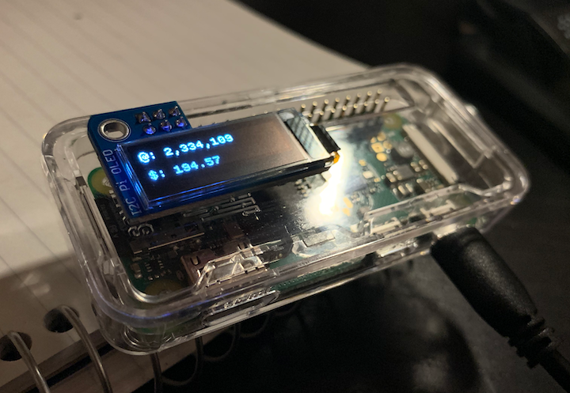
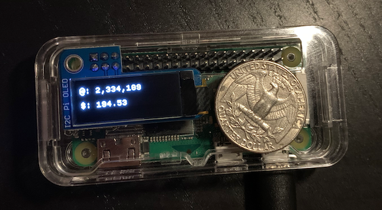
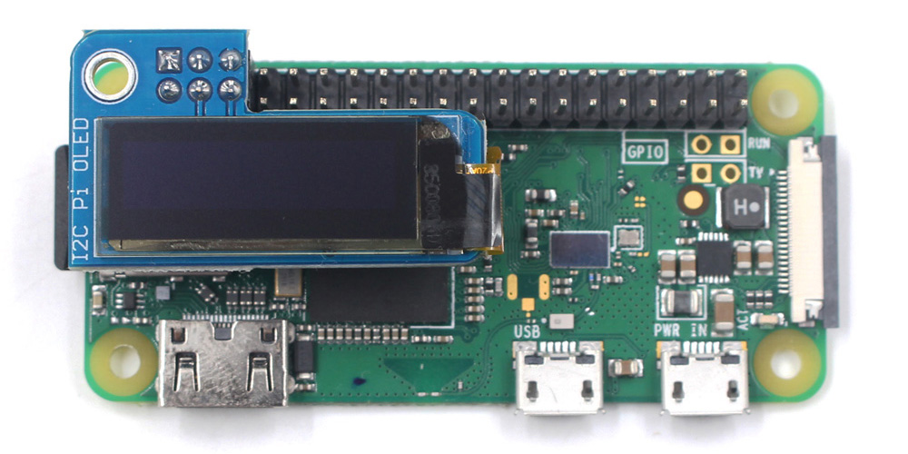

# How to Build a Satoshi Piggy Bank with Raspberry Pi 🐷

I tweeted [this](https://twitter.com/kiltonred/status/1180359423727783936) sometime ago:

>Bitcoin hardware wallet that’s WiFi connected and shows the dollar value of the bitcoin within it would be useful as a piggy bank for kids.
>
>Watching their savings grow over the long haul would help kids develop low time preference

Then I decided to build it myself. I didn't build a hardware wallet, but a little device that can monitor how many satoshis a given bitcoin address has and the current US dollar value of those satoshis. See [this Reddit post](https://www.reddit.com/r/Bitcoin/comments/dgzzxp/i_made_a_satoshis_piggy_bank_for_my_son/) for more details.

---





The rest of this document is a tutorial on how to build one of these.

## Assumptions about you

Before we get too deep into this tutorial, let's set some expectations. I'm expecting that you:

* Already have a bitcoin address that you want to monitor (it can be a segwit or a legacy address)
* Are comfortable with using the terminal app (or willing to learn)

---

Let's get started.

## Parts & tools 🛠

### Required

#### [Raspberry Pi Zero starter kit](https://www.amazon.com/gp/product/B0748MBFTS) ($27)

You won't need all the items in this kit, but it's still a good deal.

#### [32GB microSD card](https://www.amazon.com/gp/product/B079GTYCW4) ($6)

You'll need a microSD card with at least 8GB of storage. If you have one lying around, you don't need to buy a new one.

#### [Tiny screen](https://www.amazon.com/gp/product/B07T4LGTWT) ($14)

This is the tiny screen where the satoshi balance and dollar value will be displayed.

It's a knock-off of the out-of-stock [Adafruit PiOLED - 128x32 Monochrome OLED Add-on for Raspberry Pi](https://www.adafruit.com/product/3527)

#### [Soldering iron kit](https://www.amazon.com/gp/product/B07PDK3MX1) ($10)

Did you notice the little pins that are sticking out of the Pi in the picture? These come as a separate part of the Pi kit. You'll need to solder them onto the Pi before you can plug-in the display.

This soldering kit comes with soldering wire, which you'll learn how to use.

### Other tools you might need, if you don't already have

#### SD card reader

You'll need a way to plug-in the microSD card in your desktop to install the Pi software. The microSD linked above comes with an adapter, so if you have a standard SD card reader on your desktop, you're good. Otherwise, you'll need an external SD card reader [like this](https://www.amazon.com/SmartQ-C307-Portable-MicroSDHC-MicroSDXC/dp/B06ZYXR7DL).

#### USB keyboard and mouse

You'll need a USB keyboard and mouse to control the Pi once you start it up.

(Alternatively, if you're an advanced user, you can control the Pi using SSH from your desktop. Search YouTube for tutorials on that.)

## Soldering the pins onto the Pi 🔥

Once you have your Pi and soldering kits, you can get started by soldering the pins onto the Pi. [This YouTube video tutorial](https://www.youtube.com/watch?v=UDdbaMk39tM) shows how:

[](https://www.youtube.com/watch?v=UDdbaMk39tM)

## Installing the operating system on the Pi 💻

When you receive your Pi, it'll be a brick without any software. The first thing you'll need to do is install the operating system. [This YouTube video tutorial](https://www.youtube.com/watch?v=GJDIgS8nres) shows how:

[](https://www.youtube.com/watch?v=GJDIgS8nres)

## Put the Pi in the case 🥧

Now that you're done with soldering and you have the microSD card inserted into the Pi, you can put the Pi inside the clear case.

Use the case parts that will have windows for the pins on both sides.

## Plug-in the tiny screen

The tiny screen goes over the case. Plug it in the correct location, as shown in this picture (but over the case)



## Install the software for the tiny screen

This part of the tutorial may feel a little uncertain. Follow the steps below and hopefully you'll get through it!

For this step, you'll need some knowledge of the Raspberry Pi terminal app. This [YouTube video tutorial](https://www.youtube.com/watch?v=UW3UxK4Tiqg) may be a good introduction.

Launch the terminal app on your Pi and follow the instructions below

### Update Pi and Python libraries

Enter the commands that you see in the _**"Update Your Pi and Python"**_ section of [this page](https://learn.adafruit.com/circuitpython-on-raspberrypi-linux/installing-circuitpython-on-raspberry-pi#update-your-pi-and-python-3-4).

### Enable the I2C thingamajig

For the tiny screen and Pi to be able to talk to each other, the I2C thing has to be enabled. To enable it follow [this guide](https://learn.adafruit.com/adafruits-raspberry-pi-lesson-4-gpio-setup/configuring-i2c).

After going through the guide above, enter the command below to see if things are working

```bash
sudo i2cdetect -y 0
```

If a number shows up in the grid that means your Pi is now seeing the connected screen!

### Keep installing stuff

As [these instructions](https://learn.adafruit.com/adafruit-pioled-128x32-mini-oled-for-raspberry-pi/usage) show, you'll next need to run the following commands:

```bash
sudo apt-get install python3-pip
```

Then

```bash
sudo apt-get install python3-pil
```

If the above two commands complete without errors, you're good! 👍

## Run the Python script 🐍

Now you're ready to start running Python code to display things on the screen.

Download the code using `git clone` by entering this command

```bash
git clone https://github.com/kiltonred/satoshi-piggy-bank.git
```

Run the code

```bash
sudo python3 ./satoshi-piggy-bank/code/piggy-bank.py --address 1dice8EMZmqKvrGE4Qc9bUFf9PX3xaYDp --fontsize 11 --lineheight 20 --refreshrate 3600
```

Hopefully you're now seeing the satoshis and dollar value on the screen?

### Options for the Python script

In the above command, you can see values such as `1dice8EMZmqKvrGE4Qc9bUFf9PX3xaYDp`. Replace this address with your own. You can replace any of the other options, too.

The options are:

Name|Default|Description
-|-|-
`--address`|`1dice8EMZ...`|The Bitcoin address to track
`--fontsize`|`14`|How big the font on the screen is
`--lineheight`|`20`|How far away the lines are<br>from each other
`--refreshrate`|`3600` (in seconds)|How often the numbers<br>are updated

Re-run the command above with different options to find the configurations you like the most.

## Run the `piggy-bank.py` script on start-up

You don't want to run this command manually every time you plug-in your Pi. You want it to run automatically.

To make that happen, edit the file called `/etc/rc.local`. If you're new to editing files using the terminal, [watch this tutorial](https://www.youtube.com/watch?v=boD-opv0fMs).

To get started, enter

```bash
sudo nano /etc/rc.local
```

That will open `/etc/rc.local` in the `nano` editor.

Before the the line that says `exit 0`, paste your `piggy-bank.py` script command.

After you finish, your `/etc/rc.local` file should look something like this

```bash
#!/bin/sh -e
#
# rc.local
#
# This script is executed at the end of each multiuser runlevel.
# Make sure that the script will "exit 0" on success or any other
# value on error.
#
# In order to enable or disable this script just change the execution
# bits.
#
# By default this script does nothing.

# Print the IP address
_IP=$(hostname -I) || true
if [ "$_IP" ]; then
  printf "My IP address is %s\n" "$_IP"
fi

sudo python3 /home/pi/satoshi-piggy-bank/code/piggy-bank.py --address 1dice8EMZmqKvrGE4Qc9bUFf9PX3xaYDp --fontsize 14 --lineheight 20 --refreshrate 3600

exit 0
```

Now to save and exit `nano`, press `Ctrl`+`x`. It will ask if you want to save the changes, press `y` for `Yes`. Next it will ask if you want to save using the same file name, press `Enter`.

## Test the start-up script

Unplug your Pi and plug it back in. Within a minute or so, the `piggy-bank.py` script should run and it should update the screen.

## You're done!

That's the end of the tutorial. Did you get it working? If you did, congratulations! 🎉

If you didn't...

## Questions or comments

I know these instructions are vague and hard to follow in many areas. If you're stuck some where, need clarification, or help, [post an issue](https://github.com/kiltonred/satoshi-piggy-bank/issues/new).
